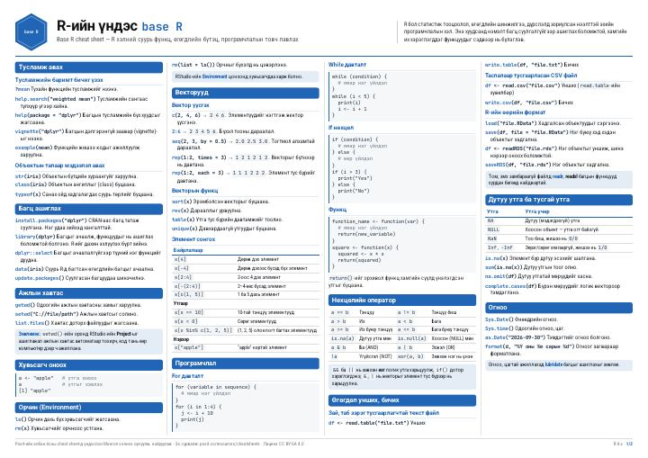
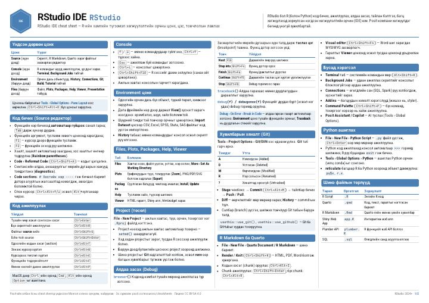
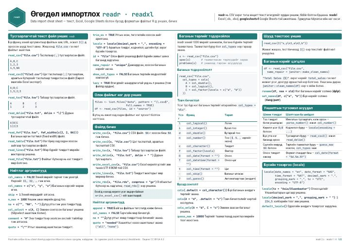
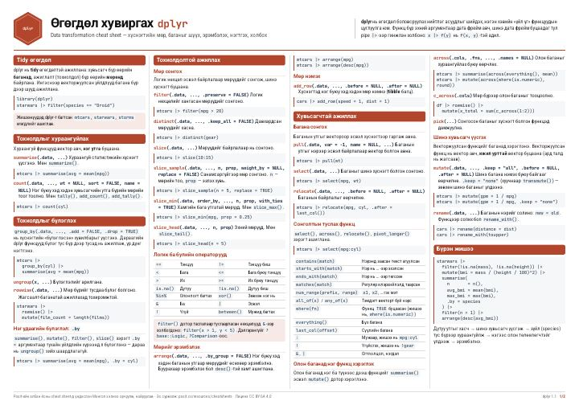
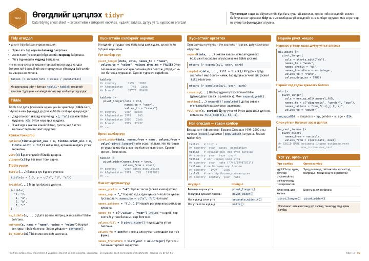
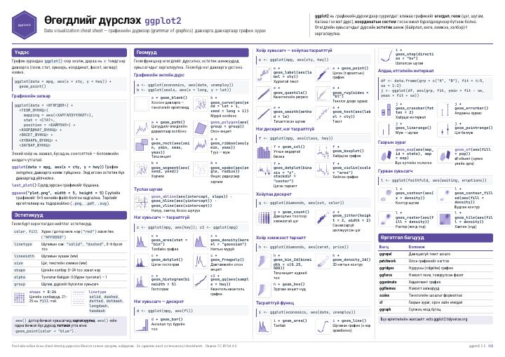

```{=html}
<header class="cs-hero column-page">
  <p class="cs-eyebrow"><i class="bi bi-journal-code"></i> Гарын авлага</p>
  <h1>R ба өгөгдлийн шинжилгээний cheatsheet</h1>
  <p class="cs-lead">
    R программчлал, өгөгдөл импортлох, хувиргах, цэгцлэх, дүрслэх үндсэн
    функцуудыг нэг хуудсанд багтаасан товч гарын авлагууд. Бүгд монгол хэл
    дээр, A4 хэвтээ хэлбэрээр хэвлэхэд бэлэн.
  </p>
  <ul class="cs-stats" aria-label="Товч мэдээлэл">
    <li><strong>6</strong> гарын авлага</li>
    <li><strong>PDF</strong> · A4 хэвтээ</li>
    <li><strong>Үнэгүй</strong> · CC BY-SA 4.0</li>
  </ul>
</header>

<nav class="cs-path column-page" aria-label="Санал болгох суралцах дараалал">
  <p class="cs-path-title">Санал болгох дараалал</p>
  <ol>
    <li><a href="#cs-01"><span>01</span> R-ийн үндэс</a></li>
    <li><a href="#cs-02"><span>02</span> RStudio</a></li>
    <li><a href="#cs-03"><span>03</span> Импортлох</a></li>
    <li><a href="#cs-04"><span>04</span> Хувиргах</a></li>
    <li><a href="#cs-05"><span>05</span> Цэгцлэх</a></li>
    <li><a href="#cs-06"><span>06</span> Дүрслэх</a></li>
  </ol>
</nav>

<div class="cs-grid column-page">

  <article class="cs-card" id="cs-01" style="--cs-accent:#2563eb">
    <a class="cs-thumb" href="01_R-iin_undes_base-R.pdf" target="_blank" rel="noopener" aria-label="R-ийн үндэс PDF нээх">
      
      <span class="cs-num">01</span>
    </a>
    <div class="cs-body">
      <p class="cs-cat">Эхлэл</p>
      <h3>R-ийн үндэс</h3>
      <p class="cs-pkg"><code>base R</code></p>
      <p>Вектор, жагсаалт, матриц, data frame, фактор зэрэг өгөгдлийн төрөл; функц бичих, нөхцөл ба давталт. Нэмэлт багц суулгалгүйгээр хийж болох үндсэн командууд.</p>
      <p class="cs-meta"><i class="bi bi-file-earmark-pdf"></i> 2 хуудас · 300 KB</p>
      <div class="cs-actions">
        <a class="btn btn-primary btn-sm" href="01_R-iin_undes_base-R.pdf" target="_blank" rel="noopener"><i class="bi bi-eye"></i> Нээх</a>
        <a class="btn btn-outline-secondary btn-sm" href="01_R-iin_undes_base-R.pdf" download><i class="bi bi-download"></i> Татах</a>
      </div>
    </div>
  </article>

  <article class="cs-card" id="cs-02" style="--cs-accent:#0891b2">
    <a class="cs-thumb" href="02_RStudio_IDE.pdf" target="_blank" rel="noopener" aria-label="RStudio IDE PDF нээх">
      
      <span class="cs-num">02</span>
    </a>
    <div class="cs-body">
      <p class="cs-cat">Эхлэл</p>
      <h3>RStudio IDE</h3>
      <p class="cs-pkg"><code>RStudio</code></p>
      <p>Цонхнуудын бүтэц, код бичих, ажиллуулах, алдаа засах. Хамгийн хэрэгтэй гарын товчлолууд, файл ба сесс, кодын snippet.</p>
      <p class="cs-meta"><i class="bi bi-file-earmark-pdf"></i> 2 хуудас · 356 KB</p>
      <div class="cs-actions">
        <a class="btn btn-primary btn-sm" href="02_RStudio_IDE.pdf" target="_blank" rel="noopener"><i class="bi bi-eye"></i> Нээх</a>
        <a class="btn btn-outline-secondary btn-sm" href="02_RStudio_IDE.pdf" download><i class="bi bi-download"></i> Татах</a>
      </div>
    </div>
  </article>


  <article class="cs-card" id="cs-03" style="--cs-accent:#059669">
    <a class="cs-thumb" href="03_Ogogdol_importloh_readr.pdf" target="_blank" rel="noopener" aria-label="Өгөгдөл импортлох PDF нээх">
      
      <span class="cs-num">03</span>
    </a>
    <div class="cs-body">
      <p class="cs-cat">Өгөгдөлтэй ажиллах</p>
      <h3>Өгөгдөл импортлох</h3>
      <p class="cs-pkg"><code>readr</code> <code>readxl</code></p>
      <p>CSV, Excel, Google Sheets-ээс өгөгдөл унших, баганын төрлийг (<code>col_types</code>) тохируулах, үр дүнгээ файлд хадгалах.</p>
      <p class="cs-meta"><i class="bi bi-file-earmark-pdf"></i> 2 хуудас · 304 KB</p>
      <div class="cs-actions">
        <a class="btn btn-primary btn-sm" href="03_Ogogdol_importloh_readr.pdf" target="_blank" rel="noopener"><i class="bi bi-eye"></i> Нээх</a>
        <a class="btn btn-outline-secondary btn-sm" href="03_Ogogdol_importloh_readr.pdf" download><i class="bi bi-download"></i> Татах</a>
      </div>
    </div>
  </article>

  <article class="cs-card" id="cs-04" style="--cs-accent:#dc2626">
    <a class="cs-thumb" href="04_Ogogdol_huvirgah_dplyr.pdf" target="_blank" rel="noopener" aria-label="Өгөгдөл хувиргах PDF нээх">
      
      <span class="cs-num">04</span>
    </a>
    <div class="cs-body">
      <p class="cs-cat">Өгөгдөлтэй ажиллах</p>
      <h3>Өгөгдөл хувиргах</h3>
      <p class="cs-pkg"><code>dplyr</code></p>
      <p>Мөр шүүх, багана сонгох, шинэ хувьсагч үүсгэх, бүлэглэж хураангуйлах, хүснэгт нэгтгэх: <code>filter()</code>, <code>mutate()</code>, <code>summarise()</code>, <code>group_by()</code>.</p>
      <p class="cs-meta"><i class="bi bi-file-earmark-pdf"></i> 2 хуудас · 292 KB</p>
      <div class="cs-actions">
        <a class="btn btn-primary btn-sm" href="04_Ogogdol_huvirgah_dplyr.pdf" target="_blank" rel="noopener"><i class="bi bi-eye"></i> Нээх</a>
        <a class="btn btn-outline-secondary btn-sm" href="04_Ogogdol_huvirgah_dplyr.pdf" download><i class="bi bi-download"></i> Татах</a>
      </div>
    </div>
  </article>

  <article class="cs-card" id="cs-05" style="--cs-accent:#7c3aed">
    <a class="cs-thumb" href="05_Ogogdol_tsegtsleh_tidyr.pdf" target="_blank" rel="noopener" aria-label="Өгөгдөл цэгцлэх PDF нээх">
      
      <span class="cs-num">05</span>
    </a>
    <div class="cs-body">
      <p class="cs-cat">Өгөгдөлтэй ажиллах</p>
      <h3>Өгөгдөл цэгцлэх</h3>
      <p class="cs-pkg"><code>tidyr</code></p>
      <p>Tidy өгөгдлийн зарчим, өргөн ба урт хэлбэр хооронд хувиргах (<code>pivot_longer</code>, <code>pivot_wider</code>), багана салгах, нийлүүлэх, дутуу утгатай ажиллах.</p>
      <p class="cs-meta"><i class="bi bi-file-earmark-pdf"></i> 2 хуудас · 296 KB</p>
      <div class="cs-actions">
        <a class="btn btn-primary btn-sm" href="05_Ogogdol_tsegtsleh_tidyr.pdf" target="_blank" rel="noopener"><i class="bi bi-eye"></i> Нээх</a>
        <a class="btn btn-outline-secondary btn-sm" href="05_Ogogdol_tsegtsleh_tidyr.pdf" download><i class="bi bi-download"></i> Татах</a>
      </div>
    </div>
  </article>


  <article class="cs-card" id="cs-06" style="--cs-accent:#ea580c">
    <a class="cs-thumb" href="06_Ogogdol_durslekh_ggplot2.pdf" target="_blank" rel="noopener" aria-label="Өгөгдөл дүрслэх PDF нээх">
      
      <span class="cs-num">06</span>
    </a>
    <div class="cs-body">
      <p class="cs-cat">Дүрслэл</p>
      <h3>Өгөгдөл дүрслэх</h3>
      <p class="cs-pkg"><code>ggplot2</code></p>
      <p>Графикийн дүрэм: геом (цэг, шугам, багана, гистограмм, violin), өнгө ба масштаб, facet-ээр хуваах, гарчиг ба загвар (theme).</p>
      <p class="cs-meta"><i class="bi bi-file-earmark-pdf"></i> 3 хуудас · 608 KB</p>
      <div class="cs-actions">
        <a class="btn btn-primary btn-sm" href="06_Ogogdol_durslekh_ggplot2.pdf" target="_blank" rel="noopener"><i class="bi bi-eye"></i> Нээх</a>
        <a class="btn btn-outline-secondary btn-sm" href="06_Ogogdol_durslekh_ggplot2.pdf" download><i class="bi bi-download"></i> Татах</a>
      </div>
    </div>
  </article>


</div>

<section class="cs-soon column-page" aria-label="Удахгүй нэмэгдэх">
  <div>
    <p class="cs-eyebrow"><i class="bi bi-hourglass-split"></i> Удахгүй</p>
    <h3>Дараагийн гарын авлагууд</h3>
    <p>Статистикийн тест сонгох, регрессийн загвар, амьдрах чадварын шинжилгээ зэрэг сэдвүүдийг нэмэхээр төлөвлөж байна.</p>
  </div>
  <a class="btn btn-outline-secondary btn-sm" href="https://github.com/zorigoobayar/team-of-biostatistics/issues/new?title=Cheatsheet%20%D1%81%D0%B0%D0%BD%D0%B0%D0%BB" target="_blank" rel="noopener"><i class="bi bi-lightbulb"></i> Сэдэв санал болгох</a>
</section>
```

::: {.callout-note appearance="simple" icon="false" .cs-credit .column-page}
**Эх сурвалж ба лиценз.** Эдгээр гарын авлагыг [Posit-ийн албан ёсны cheatsheet](https://posit.co/resources/cheatsheets/)-үүдэд үндэслэн монгол хэлнээ орчуулж, найруулав. [CC BY-SA 4.0](https://creativecommons.org/licenses/by-sa/4.0/) лицензийн дагуу чөлөөтэй хуваалцаж, ашиглаж болно. Орчуулгын алдаа олсон бол [GitHub дээр мэдэгдээрэй](https://github.com/zorigoobayar/team-of-biostatistics/issues/new).
:::
