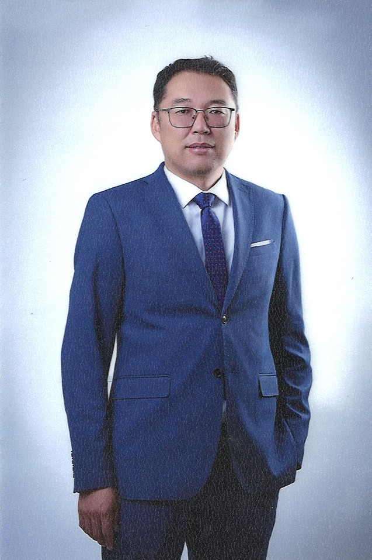

# Our Team

### Манай баг

Манай баг нь биостатистик, тархвар судлал,
эрүүл мэндийн судалгаа болон өгөгдлийн шинжлэх
ухааны чиглэлээр ажилладаг.

## Our Team

<!-- Б.Батзориг -->

<h3>Б.Батзориг</h3>

НЭМУ-ны доктор

<h4>Боловсрол</h4>

<ul>
  <li><strong>Бакалавр:</strong> Хэрэглээний математикч (Applied Mathematician)</li>
  <li><strong>Магистр:</strong> Хэрэглээний статистикч (Applied Statistician)</li>
  <li><strong>Доктор:</strong> Нийгмийн эрүүл мэндийн ухаан (PhD in Public Health)</li>
</ul>

<h4>Focus</h4>

<ul>
  <li>Биостатистик (Biostatistics)</li>
  <li>Статистийн загварчлал (Statistical modelling)</li>
  <li>Хэтийн төлөв (Forecasting)</li>
  <li>Түүвэрлэлтийн асуудал (Sampling issues)</li>
  <li>Клиникийн судалгаа (Clinical research)</li>
  <li>Чанарын судалгаа (Qualitative research)</li>
</ul>

<!-- Х.Сэр-Од -->

<h3>Х.Сэр-Од</h3>

Хэрэглээний статистикч

<h4>Боловсрол</h4>

<ul>
  <li><strong>Бакалавр:</strong> Хэрэглээний статистикч (Applied Statistician)</li>
  <li><strong>Магистр:</strong> Хэрэглээний статистик (Applied Statistics)</li>
</ul>

<h4>Focus</h4>

<ul>
  <li>Биостатистик (Biostatistics)</li>
  <li>Статистийн загварчлал (Statistical modelling)</li>
  <li>Хэтийн төлөв (Forecasting)</li>
  <li>Түүвэрлэлтийн асуудал (Sampling issues)</li>
  <li>Клиникийн судалгаа (Clinical research)</li>
  <li>Чанарын судалгаа (Qualitative research)</li>
</ul>

<!-- М.Эркебулан -->

<h3>М.Эркебулан</h3>

Хэрэглээний статистикч

<h4>Боловсрол</h4>

<ul>
  <li><strong>Бакалавр:</strong> Математикч (Mathematician)</li>
  <li><strong>Магистр:</strong> Хэрэглээний статистикч (Applied Statistician)</li>
</ul>

<h4>Focus</h4>

<ul>
  <li>Биостатистик (Biostatistics)</li>
  <li>Статистийн загварчлал (Statistical modelling)</li>
  <li>Хэтийн төлөв (Forecasting)</li>
  <li>Түүвэрлэлтийн асуудал (Sampling issues)</li>
  <li>Клиникийн судалгаа (Clinical research)</li>
  <li>Чанарын судалгаа (Qualitative research)</li>
</ul>

<!-- Research Students -->

🎓

<h3>Research Students</h3>

Судлаач оюутнууд

Судлаач оюутнууд биостатистик,
тархвар судлал болон статистикийн
арга зүйгээр суралцаж, судалгаа хийж байна.

<h4>Focus</h4>

<ul>
  <li>Biostatistics</li>
  <li>Epidemiology</li>
  <li>Research</li>
</ul>

## What We Work On

Манай баг дараах чиглэлүүдээр судалгаа,
сургалт болон хамтын ажиллагаа явуулна.

<ul>
  <li>Биостатистикийн арга зүй</li>
  <li>Эмнэлзүйн судалгаа</li>
  <li>Тархвар судлал</li>
  <li>Статистикийн загварчлал</li>
  <li>R программчлал</li>
  <li>Өгөгдлийн дүрслэл</li>
  <li>Дахин давтагдахуйц судалгаа</li>
</ul>

